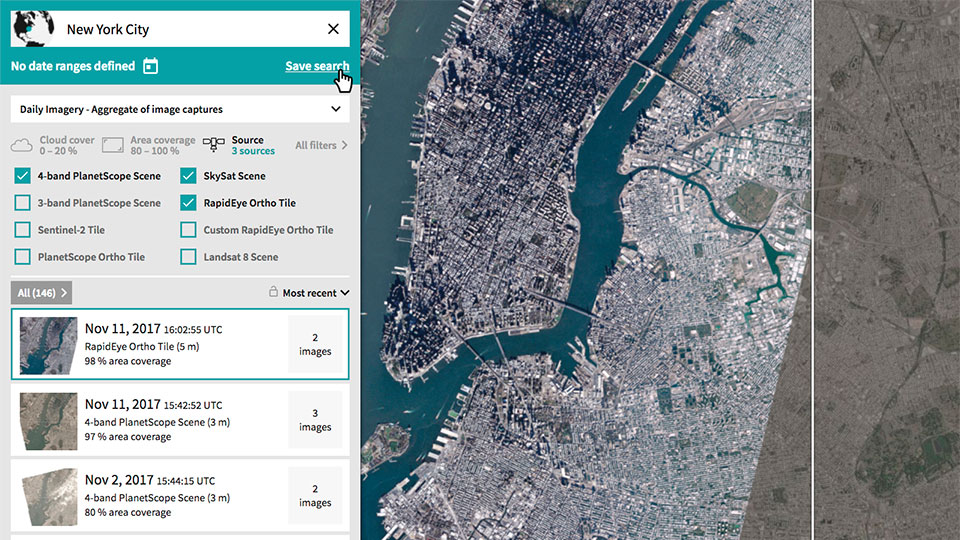

# Planet Explorer
**[Planet Explorer](https://www.planet.com/explorer/)** is an online tool leveraged to easily search and browse recent and past geospatial data, enabling users to see change across the planet over time. It can be used to search Planet's catalog of imagery, view metadata, and download full-resolution images.

## Search
You can search Planet's imagery by date, location, and various metadata filters in Explorer.

Let's use **[NASA's Fire Information for Resource Management System (FIRMS)](https://firms.modaps.eosdis.nasa.gov/map/)** to find locations of some recent fires and find relevant Planet imagery in Explorer.

Note: the FIRMS map includes coordinates in the url with this pattern `c:lon,lat`, e.g. this url
`https://firms.modaps.eosdis.nasa.gov/map/#z:10;c:-121.5,39.7;t:adv-points;d:2018-11-02..2018-11-30;l:firms_viirs` contains `c:-121.5,39.7`. 
Planet Explorer's search bar will expect these coordinates in the opposite order (latitude, longitude).

Try searching for `39.7,-121.5` in Explorer.

## Compare
Explorer has a built in compare tool to let you visualize changes over time.

