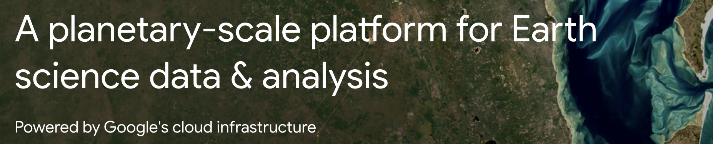

This platform stores large remote sensing datasets and enables analysis on Google's scalable cloud compute infrastructure.

Not having to move data in order to change or share your analysis code enables faster iteration and collaboration.

Additionally, you can pull in multiple datasets from the ever-growing **[dataset catalog](https://developers.google.com/earth-engine/datasets/catalog)** and fuse them together in new ways in just a few lines of code.