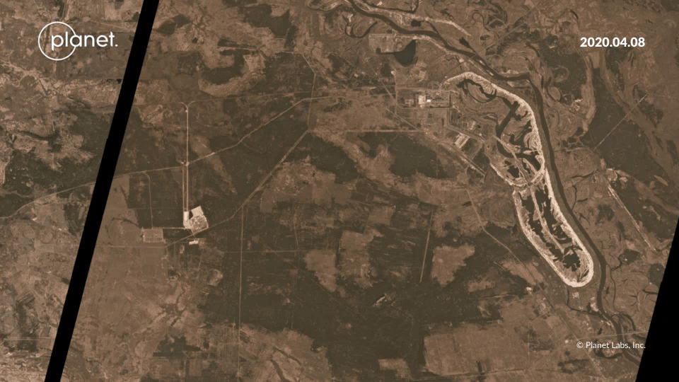

Browse, compare, and share imagery of any location on Earth’s landmass with Planet Stories. Use the Compare and Timelapse tools to monitor events and empower narratives backed by recent data.

Here are some example stories:
## Lake sediment fluctuation 

[https://www.planet.com/stories/2018-utah-lake-post-fire-sediment-flux-M0MVxLCWR](https://www.planet.com/stories/2018-utah-lake-post-fire-sediment-flux-M0MVxLCWR)

## Smoke from a forest fire

[https://www.planet.com/stories/chernobyl-forest-fire-SAlrTR3ZR](https://www.planet.com/stories/chernobyl-forest-fire-SAlrTR3ZR)
